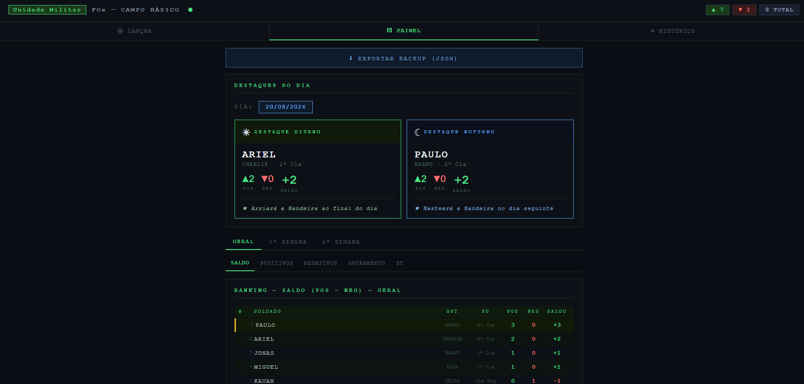
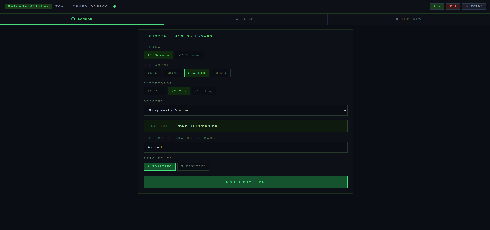
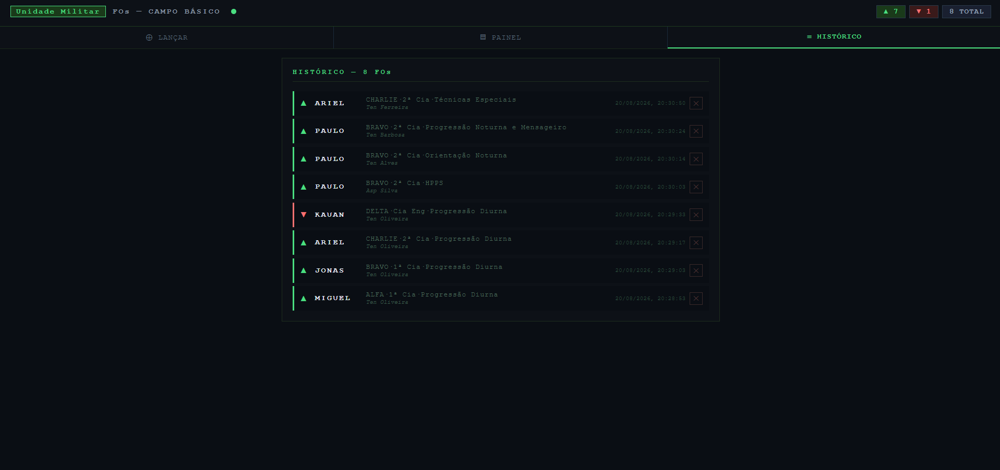

# Field Observation System for Basic Field Training



<table>
<tr>
<td></td>
<td></td>
</tr>
<tr>
<td align="center"><sub>Register FO</sub></td>
<td align="center"><sub>History</sub></td>
</tr>
</table>

## Motivation

During military field training exercises, instructors from each station record Field Observations (FOs) of soldiers throughout the day, positive and negative behaviors reflecting performance, attitude, and discipline.

The traditional process was manual: each instructor took notes on paper, and at the end of the day someone consolidated everything by hand to determine who stood out. This process created three main problems:

**1. Slow consolidation prone to errors**
With multiple instructors recording on separate sheets, consolidating data at the end of the day required rework, manual transcription, and was susceptible to losses and inconsistencies.

**2. Time-consuming selection of daily highlights**
Choosing the daytime and nighttime highlight, which determines who raises or lowers the national flag, required someone to manually add up each soldier's FOs at the end of each period. The more FOs, the more laborious and time-consuming.

**3. No consolidated view of the training**
There was no quick way to answer questions like: who has the best overall score? Which group is standing out? Which sub-unit has the most negative FOs?

---

## The Solution

This app centralizes all FOs in a cloud database accessible from any mobile device, in real time. Each instructor records FOs from their station directly on their phone, and the system:

- **Automatically determines the daytime and nighttime highlight** for each day, based on the FO balance (positives minus negatives), eliminating the manual counting process
- **Displays a complete ranking** of soldiers by score, positives, or negatives, filterable by training week
- **Identifies the corresponding honor**: the daytime highlight lowers the flag at the end of the day; the nighttime highlight raises the flag the following morning
- **Consolidates an overall training view** covering soldier, group, and sub-unit, available to any instructor in real time

The result is a process that previously took minutes of manual consolidation becoming instant and available to everyone simultaneously.

---

## Demo Notice

This repository uses placeholder Firebase credentials (`YOUR_API_KEY`, `YOUR_PROJECT`, etc). It does not connect to any live database and exposes no real data. Instructor names, unit names, and all other identifiers in `index.html` are fictional, for demonstration purposes only.

The screenshots above are from a live test run of the app, using placeholder test names entered for demonstration. No real personal data is shown.

Opening `index.html` as is will show the loading screen indefinitely, since there is no real Firebase project behind it. This is expected. To run it live you need to create your own free Firebase project and paste your own credentials, as described in the Setup section below.

---

## Features

- **FO registration**: positive and negative, by soldier, group, sub-unit, and station
- **Real-time sync**: any instructor records and everyone sees it instantly
- **Analytics dashboard**: rankings by score, positives, negatives, group, and sub-unit
- **Week filter**: separate view for week 1 and week 2 of training
- **Daily highlights**: automatic calculation of daytime and nighttime highlights with day selector
- **Out of station**: FO registration for moments outside formal instruction
- **Full history**: all FOs with deletion option
- **Backup export**: download data as JSON
- **PWA**: works as an app when added to the home screen on mobile

---

## Tech Stack

| Layer     | Technology              | Role                           |
| --------- | ----------------------- | ------------------------------ |
| Front-end | HTML5                   | Interface structure            |
| Front-end | CSS3                    | Styling and responsive layout  |
| Front-end | JavaScript (ES Modules) | Logic and DOM manipulation     |
| Back-end  | Firebase Firestore      | Real-time NoSQL cloud database |
| Hosting   | Netlify                 | Serving the HTML file publicly |

---

## Architecture

```
┌─────────────────────────────┐
│        MOBILE DEVICE        │
│                             │
│  index.html                 │
│  ├── HTML  → structure      │
│  ├── CSS   → appearance     │
│  └── JS    → logic          │
│       └── Firebase SDK      │
└──────────────┬──────────────┘
               │ WebSocket
               │
┌──────────────▼──────────────┐
│   FIREBASE FIRESTORE        │
│   (Google servers)          │
│                             │
│   collection: "fos"         │
│     └── JSON documents      │
└──────────────┬──────────────┘
               │ onSnapshot()
               │ (notifies all)
               │
┌──────────────▼──────────────┐
│   OTHER DEVICES             │
│   (other instructors)       │
│   screen updates in <1s     │
└─────────────────────────────┘
```

The app is a single HTML file. Netlify serves this file when someone accesses the URL. After that, the browser runs the JavaScript which connects directly to Firebase. Netlify is no longer involved.

---

## Setup

### 1. Firebase

1. Go to [console.firebase.google.com](https://console.firebase.google.com)
2. Create a project
3. Go to **Firestore Database** → **Create database** → **Test mode**
4. Select region `southamerica-east1`
5. Go to **Project settings** → **`</>`** (Web)
6. Register a web app and copy the `firebaseConfig` object

### 2. Configure the file

Open `index.html` and replace the credentials block:

```js
const firebaseConfig = {
  apiKey: "YOUR_API_KEY",
  authDomain: "YOUR_PROJECT.firebaseapp.com",
  projectId: "YOUR_PROJECT",
  storageBucket: "YOUR_PROJECT.firebasestorage.app",
  messagingSenderId: "YOUR_MESSAGING_SENDER_ID",
  appId: "YOUR_APP_ID",
};
```

### 3. Customize

In `index.html`, locate and adjust:

**Groups by week:**

```js
const SEMANA_GPT = {
  "Week 1": ["ALPHA", "BRAVO", "CHARLIE", "DELTA"],
  "Week 2": ["ECHO", "FOXTROT", "GOLF", "HOTEL"],
};
```

**Sub-units by group:**

```js
const GPT_SU = {
  ALPHA: ["1st Co", "2nd Co", "Eng Co"],
  // ...
};
```

**Instructors by station:**

```js
const INSTRUCTORS = {
  "Day Orientation": { "Week 1": "Lt Smith", "Week 2": "Lt Jones" },
  // ...
};
```

### 4. Deploy

**Option A: Netlify Drop (easiest)**

1. Go to [drop.netlify.com](https://drop.netlify.com)
2. Drag the `index.html` file
3. Share the generated URL

**Option B: GitHub Pages**

1. Push the repository to GitHub
2. Go to **Settings** → **Pages**
3. Source: `main` / `root`
4. Generated URL: `https://yourusername.github.io/repo-name`

---

## Code Structure

```
index.html
├── <head>          : metadata, embedded CSS
├── <body>
│   ├── #loading    : initial loading screen
│   ├── #app
│   │   ├── header  : badge, stats, sync indicator
│   │   ├── nav     : 3 tabs: Register, Dashboard, History
│   │   └── main
│   │       ├── #view-register   : registration form
│   │       ├── #view-dashboard  : highlights + rankings
│   │       └── #view-history    : FO list
│   └── <script type="module">
│       ├── Firebase init
│       ├── Global state (state, fos, etc.)
│       ├── onSnapshot()     : real-time listener
│       ├── Navigation       : setView, setDashTab
│       ├── Form             : setWeek, setStation, register
│       ├── Aggregations     : rankSoldiers, countByKey, dailyHighlight
│       ├── Render           : renderHighlights, renderDash, renderHistory
│       └── Utils            : getDateBRT, showFlash, exportJSON
```

---

## Key Concepts

**Firebase Firestore: why NoSQL?**
FOs are self-contained documents, there are no complex relationships between entities that would justify a relational database. Firestore provides native real-time sync via WebSocket, eliminating the need for polling.

**onSnapshot: real-time listener**
Instead of querying the database periodically, `onSnapshot` keeps a WebSocket connection open. The server automatically notifies all connected clients whenever any data changes.

**Single Page Application without a framework**
Navigation between screens is done by hiding and showing `div`s with `display:none/block`. All table and card HTML is generated dynamically via `innerHTML` with template literals. No React, Vue, or any framework. Pure JavaScript.

**BRT timezone handling**
Timestamps are stored in UTC. Conversion to BRT (UTC-3) is done by subtracting 3 hours in milliseconds before extracting the date, ensuring FOs registered after UTC midnight fall on the correct day in Brazil Standard Time.

---

## PWA Usage

On iPhone/iPad:

1. Open the URL in Safari
2. Tap **Share** → **Add to Home Screen**
3. The app opens fullscreen without the Safari toolbar

On Android:

1. Open the URL in Chrome
2. Tap the three dots → **Add to home screen**

---

## License

MIT. Free to use, modify, and distribute.
